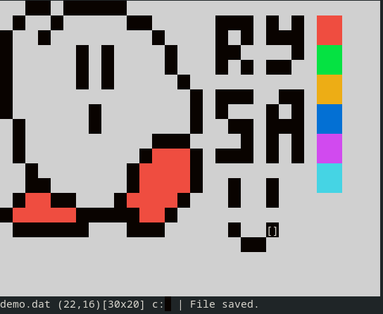

# `rysa`

`rysa` is a simple graphical terminal client for drawing pixel art written
in C (C99).



_`rysa` "graphical" interface_


_exported SVG image_

Also check out [milosc](https://github.com/vihmu/milosc)!.

# Usage

```sh
$ rysa name width height
```

If no filename is provided, `rysa` will create a plain canvas with the
dimensions 30x20.

Creating a new canvas requires the width and height to be set. Example:

```sh
$ rysa my_cool_image 20 20
```

## Features

`rysa` can use a total of 8 colors.<br/>
To select one of them, press the `c` key, then use the numeric keys row on your
keyboard:

| key | exported color | name     |
| --- | ---            | ---      |
| 0   | #2D383A        | black    |
| 1   | #D92121        | red      |
| 2   | #3AA655        | green    |
| 3   | #FFDB00        | yellow   |
| 4   | #0081AB        | blue     |
| 5   | #C154C1        | magenta  |
| 6   | #44D7A8        | cyan     |
| 7   | #FDFDFD        | white    |

`rysa` can export to the following formats:

- bitmap:
  - XPM (XBitMap)
  - SVG
  - PPM (NetBPM)

- extra:
  - `.dat` (save file format, can be reopened)
  - `.asc` (runnable output script in the terminal)

## Controls

Movement is done with the arrow keys or Vim keys (HJKL).

| key | command                          |
| --- | ---                              |
| z   | draw a pixel                     |
| x   | delete a pixel                   |
| c   | choose a color                   |
| f   | fill background with color       |
| t   | trace a line between two coords. |
| s   | save to file                     |
| e   | export current canvas            |
| q   | quit (will notify if not saved)  |

# Compiling

Provided you have GCC or clang installed, just run `make.sh` in the repo's root directory.

## License

(C) 2026 vihmu

This software is licensed under the [Apache 2.0](./LICENSE) license.

## References

- https://netpbm.sourceforge.net/doc/ppm.html
- https://espterm.github.io/docs/VT100%20escape%20codes.html
